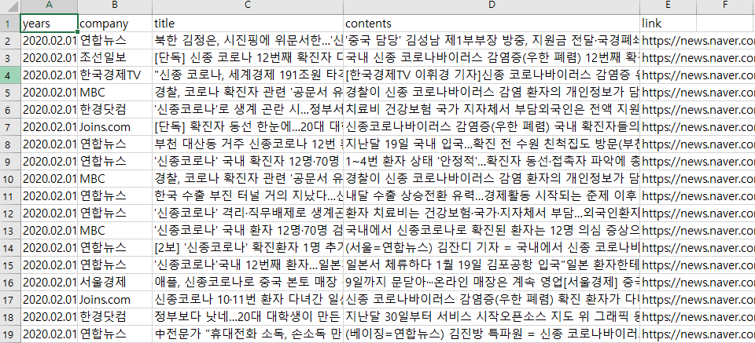

# naver_news_crawler

## Notes
- 네이버 뉴스를 크롤링 하는 코드

- 안티크롤링 해결 및 기사내용 전처리 추가

- CSV 형태로 수집된 파일 도출
## How to use
~~~
python main.py
~~~
## Results
- 검색 조건 입력

  
  
- 크롤링 결과

  
  
## reference
- https://bumcrush.tistory.com/155
